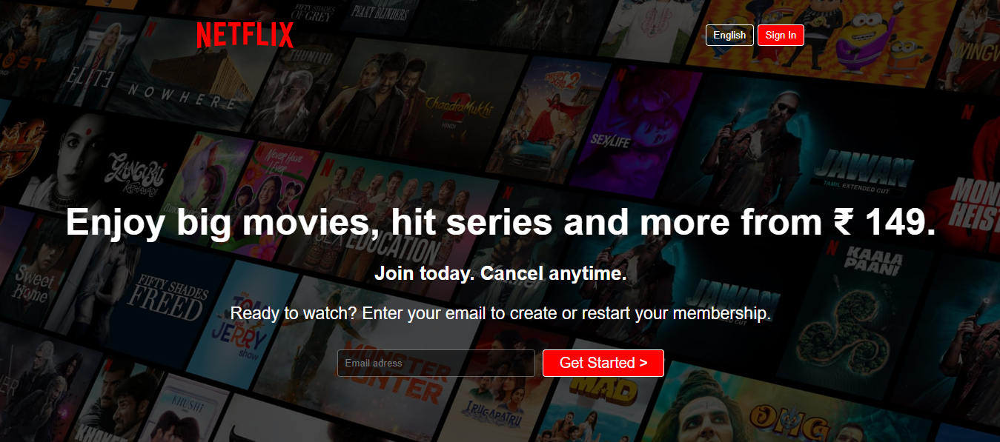

# 🎥 Netflix UI Clone

A sleek and modern **Netflix UI Clone** built with pure **HTML** and **CSS**. This project is a visual replica of Netflix's design, focusing on its layout, typography, and color scheme. While it doesn't include backend functionality or video streaming, it's a great practice project for honing front-end development skills.

🌟 **Features:**
- Responsive layout
- Netflix-inspired design
- Clean and organized code
📸 **Screenshot:**  
Below is a screenshot of the UI for reference:  
  

📂 **Easy to Navigate Sections:**  
The project is structured with clear and easy-to-navigate sections, making it simple to understand and modify.

🎓 **Perfect for Beginners:**  
This project is ideal for beginners looking to practice and enhance their front-end development skills.

🚀 **Live Demo:**  
[🔗 Visit the Project](https://shouvikmistry.github.io/Netflix-UI-Clone/)

---
Feel free to explore and customize the code to make it your own!